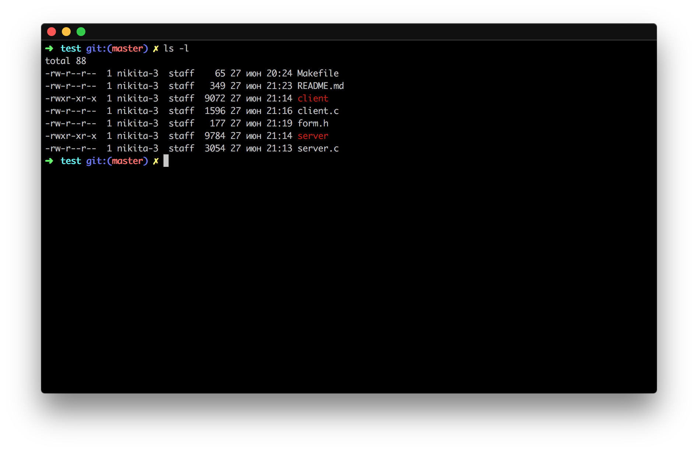
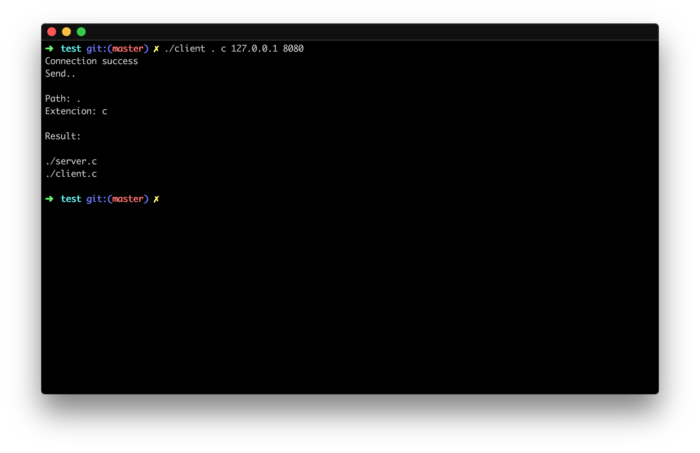
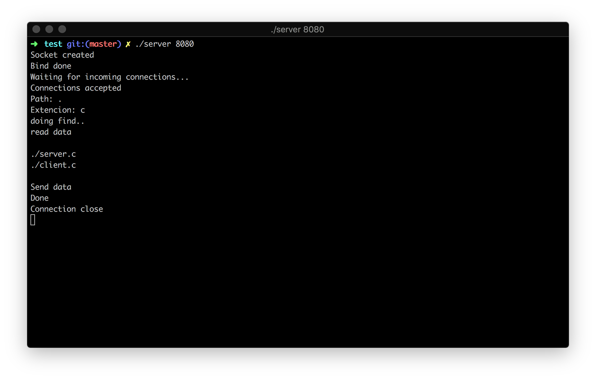

# client-server-ls

This is simple client-server application.
On request gives the contents of the server folder with specified extension.

## How compile
This application only for Unix base sustem
```
make
```

## How to use
* Server start:
```
./server <port>
```

* Client start:
```
./client <path> <file extension> <ip> <port>
```

## Examples




